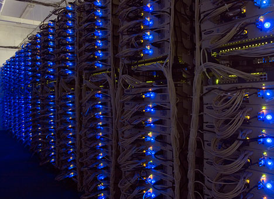

!SLIDE

# What is this Ops thing?

!SLIDE

!SLIDE

# It's also....

!SLIDE

!SLIDE

# and some of this....

!SLIDE

!SLIDE

# Okay, what is it really?

!SLIDE

!SLIDE

# What should I care about?

!SLIDE

* Networking
* Scalability
* Health
* Data Management
* Security
* Retirement

!SLIDE

# Networking 
## A finite resource.

!SLIDE
# Latency

* Limited based on capacity and distance
* How much data is flowing in relation to how many users?
* SPEED OF LIGHT! 

!SLIDE
# Bandwidth
* Satellite or EDGE vs. DSL/Leased Lines/Fiber

!SLIDE
# As a developer

* Think about how much data you're transferring between multiple the systems and the user
* Think about where your users are in relation to your apps

!SLIDE
# Scalability

!SLIDE
# Systems, Sites, and Architectures! Oh My!

!SLIDE
# Outsourcing

!SLIDE
# In-House

!SLIDE
# As a developer

* Think about all of the various supporting systems (internal and external)
* How do systems talk to each other? (Directly, Service Bus)
* Limit the number of dependencies to what is required

!SLIDE
# Monitoring

!SLIDE
# Doing something with Exceptions

!SLIDE
# What does healthy mean?

!SLIDE
# Being able to see trends

!SLIDE
# As a developer...
* Do stuff with your exceptions. (Also, write them)
* Know what healthy means, and how to tell. Write hooks to determine this
* Know what your app should do by stress-testing it. Gather data!

!SLIDE
# Data Management

!SLIDE
# Data
## It's what your users care about.

!SLIDE
# As a developer
* SAVE THE DATA!
* Expire what you don't need (Data Retention)

!SLIDE
# Security

!SLIDE
* Confidentiality
* Integrity
* Availability

!SLIDE
# Confidentality
* Role Based Access Control
* Preventing Unwanted Attacks:
* Go read [OWASP](https://www.owasp.org/index.php/Main_Page)

!SLIDE
# Integrity
* Ensure data isn't altered in transit or at rest
* Use Checksums and SSL

!SLIDE
# Availability
* Keep it running is a security concern. (e.g.: the point of Ops)
* Go back to Monitoring!

!SLIDE
# Retirement

!SLIDE
# Computers need to retire
* Things get old, data needs to be saved, things get upgraded, etc.
* Don't be afraid to get rid of old software.
* Plan death when releasing.
