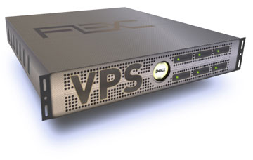
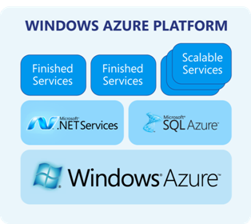

!SLIDE

# Options for Deployment
* Your own Servers
* VPS Providers
* IaaS Providers (AWS/Azure)
* PaaS Providers (ElasticBeanstalk/Heroku)

!SLIDE
# Your Own Servers

Unless you're into Ops, you shouldn't do this (or you should have a team)

<!SLIDE>

!SLIDE
* Time
* Money
* Effort

!SLIDE
# VPS Providers

<!SLIDE smbullets>
# What are they?

* Managed server instances that you can rent. 
* Using Virtualization Technologies to put many servers on one server.
* Usually have Public IP addresses
* You manage the instance completely.
* No Network Management outside of userland/software devices.
* Menu Selection

!SLIDE
# Good ones have?

* APIs
* Reasonable over subscriptions (2:1 or less)

!SLIDE
# Good ones?

* Linode
* Rackspace
* Slicehost

# When do I use this?

* Simple constraints (Memory/Disk/Network)
* Know how to manage the underlying OS
* Simple management of long-term costs. (Fixed)

!SLIDE

!SLIDE

!SLIDE
# AWS

* Managed Server Containers
* Managed Network Load Balancers (ELB)
* Managed Service Bus (SQS)
* Managed Disk (S3/EBS)
* and much more

!SLIDE
# CloudFormation

* Manage all resources using JSON

!SLIDE smaller
<code>
	{
	  "AWSTemplateFormatVersion": "2010-09-09",

	  "Description": "Role: Renderer. Amazon CloudFormation Template",

	  "Parameters": {
	    "AMI":{
	      "Description":"The AMI You want to use",
	      "Type":"String",
	      "Default":"ami-8fc476e6"
	    },
	    "InstanceType": {
	      "Description": "Renderer Server EC2 Instance Type",
	      "Type": "String",
	      "Default": "c1.xlarge",
	      "AllowedValues": ["c1.medium","c1.xlarge","cc1.4xlarge","cc2.8xlarge","cg1.4xlarge"],
	      "ConstraintDescription": "must be a valid EC2 instance type"
	    },
	    "KeyName": {
	      "Description": "Name of an existing EC2 Keypair to enable access to the machine",
	      "Type": "String",
	      "Default": "sw-production-east-va"
	    }
	  },  

	  "Resources": {
	    "RendererServerGroup": {
	      "Type": "AWS::AutoScaling::AutoScalingGroup",
	      "Properties": {
	        "AvailabilityZones": { "Fn::GetAZs": "" },
	        "LaunchConfigurationName": { "Ref": "LaunchConfig" },
	        "MinSize": "2",
	        "MaxSize": "16",
	        "Tags": [
	          { "Key": "Environment", "Value": "Production", "PropagateAtLaunch": "true" },
	          { "Key": "Role", "Value": "renderer", "PropagateAtLaunch": "true" }
	        ]
	      }
	    },

	    "LaunchConfig": {
	      "Type": "AWS::AutoScaling::LaunchConfiguration",
	      "Properties": {
	        "KeyName": { "Ref": "KeyName" },
	        "ImageId" : {"Ref":"AMI"},
	        "SecurityGroups": [ { "Ref": "InstanceSecurityGroup" }],
	        "InstanceType": { "Ref": "InstanceType" }
	      }
	    },

	    "RendererServerScaleUpPolicy" : {
	      "Type" : "AWS::AutoScaling::ScalingPolicy",
	      "Properties" : {
	        "AdjustmentType" : "ChangeInCapacity",
	        "AutoScalingGroupName" : { "Ref" : "RendererServerGroup" },
	        "Cooldown" : "300",
	        "ScalingAdjustment" : "6"
	      }
	    },

	    "RendererServerScaleDownPolicy" : {
	      "Type" : "AWS::AutoScaling::ScalingPolicy",
	      "Properties" : {
	        "AdjustmentType" : "ChangeInCapacity",
	        "AutoScalingGroupName" : { "Ref" : "RendererServerGroup" },
	        "Cooldown" : "300",
	        "ScalingAdjustment" : "-1"
	      }
	    },

	    "ScaleUpAlarm": {
	     "Type": "AWS::CloudWatch::Alarm",
	     "Properties": {
	        "AlarmDescription": "Hit it with a hammer",
	        "MetricName": "Prod-VideoRenderQueueLength",
	        "Namespace": "Test",
	        "Statistic": "Average",
	        "Period": "60",
	        "EvaluationPeriods": "2",
	        "Threshold": "60",
	        "AlarmActions": [ { "Ref": "RendererServerScaleUpPolicy" } ],        
	        "ComparisonOperator": "GreaterThanThreshold"
	      }
	    },

	    "ScaleDownAlarm": {
	     "Type": "AWS::CloudWatch::Alarm",
	     "Properties": {
	        "AlarmDescription": "Simmer Down",
	        "MetricName": "Prod-VideoRenderQueueLength",
	        "Namespace": "Test",
	        "Statistic": "Average",
	        "Period": "60",
	        "EvaluationPeriods": "5",
	        "Threshold": "30",
	        "AlarmActions": [ { "Ref": "RendererServerScaleDownPolicy" } ],
	        "ComparisonOperator": "LessThanThreshold"
	      }
	    },

	    "InstanceSecurityGroup": {
	      "Type": "AWS::EC2::SecurityGroup",
	      "Properties": {
	        "GroupDescription": "Enable SSH access to the configured server",
	        "SecurityGroupIngress" : [
	          { "IpProtocol": "tcp", "FromPort": "22", "ToPort": "22", "CidrIp": "0.0.0.0/0" }
	        ]
	      }
	    }
	  }
	}
</code>

!SLIDE
# CloudFormation

* Allows you to manage any portion of the infrastructure via CloudFormation templates
* Manage via API
* Programatically manage autoscaling policies
* ... and much more

!SLIDE
# When do I use this?

* When you need more control over network and disk
* Multi-Region considerations (US-EAST/US-WEST/AU/JP)
* More flexibility on costs - only use what you use.
* Know how to manage resources underneath.

!SLIDE

!SLIDE

!SLIDE

!SLIDE

!SLIDE
# Heroku

* Fire and Forget: Entire Platform is managed
* Fast prototyping and release to world.
* Supports multiple languages (Ruby/Python/Java (and JVM)/MOAR!!)
* Ruby/Rails: Bundle and Go
* LOTS OF ADDONS!

!SLIDE
# ElasticBeanstalk

* Similar features, but tie-in w/ AWS
* Also supports .NET

!SLIDE
# When do I use this?
* When you need to release quickly
* Don't know all that much about Infrastructure/Ops
* Simple Requirements/Simple Apps
* Spiking code or testing for larger deployments.

!SLIDE
# Caveats
* Beware of costs!
* Don't develop your app around infrastructure.
* Not everything can be solved with a hammer.

!SLIDE

