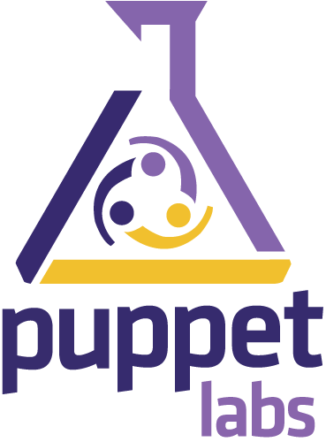
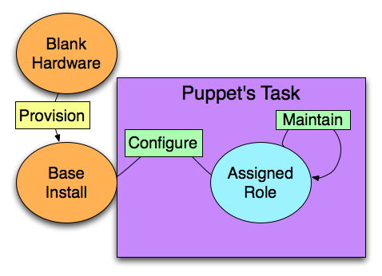
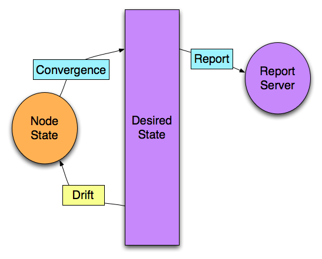
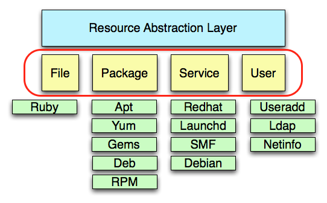

!SLIDE
# Configuration Management
* Manage Server State
* Many Tool Options (Puppet/Chef/CFEngine)

!SLIDE
# Which one should I use?
* Puppet if you want the sysadmin POV
* Chef if you want a tool as a developer
* CFengine if you're a glutton for pain.

!SLIDE

!SLIDE
## Puppet assigns and maintains Desired State

!SLIDE
## Puppet Manages Configuration Drift

!SLIDE
## Breaks down system concepts into resources
    @@@ Ruby
	user { 'jamison':
	  ensure => present,
	  gid    => 'bofh',
	}
	
!SLIDE
## Uses a Resource Abstraction Layer

	
!SLIDE small
## Package-File-Service
	@@@ Ruby	
	package { 'ntp':
	  ensure => present,
	}
	file { '/etc/ntp.conf':
	  owner   => 'root',
	  group   => 'root',
	  mode    => '0644',
	  source  => 'puppet:///modules/ntp/ntp.conf',
	  require => Package['ntp'],
	}
	service { 'ntpd':
	  ensure    => running,
	  enable    => true,
	  subscribe => File['/etc/ntp.conf'],
	}

!SLIDE
# When do I use this?
* When trying to programatically manage resources on a system
* Building out large infrastructures (200+ nodes)
* Grab modules from the [Puppet Forge](http://forge.puppetlabs.com/)
* Lotsa Documentation: [http://docs.puppetlabs.com/](http://docs.puppetlabs.com/)

!SLIDE
# Caveats
* Limited support for network devices
* Limited support for cloud providers
* Declarative!
* Must build-out own infrastructure to use Puppet (Master/Agent)

!SLIDE

!SLIDE

!SLIDE
# Chef

* Aims more at the Cloud Crowd
* Resources are programmatically applied.
* Uses Ruby Code to express Resources.

<!SLIDE small>
	@@@ Ruby
	node['ntp']['packages'].each do |ntppkg|
	  package ntppkg
	end

	service node['ntp']['service'] do
	  supports :status => true, :restart => true
	  action [ :enable, :start ]
	end

	template "/etc/ntp.conf" do
	  source "ntp.conf.erb"
	  owner node['ntp']['conf_owner'] 
	  group node['ntp']['conf_group']
	  mode "0644"
	  notifies :restart, 
	    resources(:service => node['ntp']['service'])
	end

!SLIDE
# When do I use this?
* Don't want to build infrastructure to manage infrastructure (Hosted Chef)
* Feel more comfortable with Ruby.
* Building out large infrastructures (200+ nodes)
* Grab Cookbooks: [http://community.opscode.com/cookbooks](http://community.opscode.com/cookbooks)
* Lotsa Documentation: [http://wiki.opscode.com/display/chef/Documentation](http://wiki.opscode.com/display/chef/Documentation)

!SLIDE
# Caveats
* Overloaded terms (chef/knife)
* Ruby Code is a wrapper. (Runlists and Nodes)
* Procedural concepts may conflict with each other.

